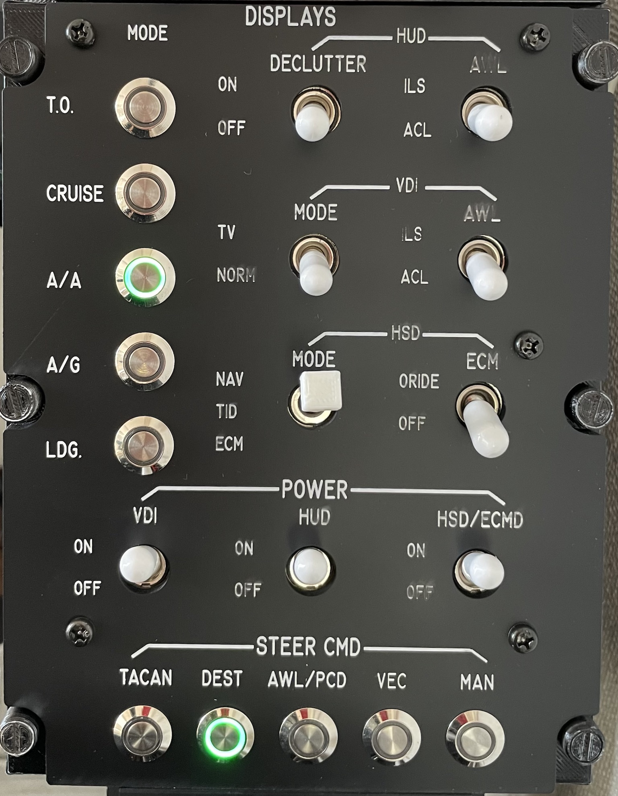

# F-14B Tomcat Display Control Panel

## Parts

* 5V/16MHz Pro Micro Board w/ ATmega32U4
* 8 on-off switches
* 1 on-off-on switch
* 10 custom push buttons with LED
* 74HC595 shift register to expand outputs (LEDs)
* 74HC165 shift registers to expand inputs (Buttons)

## Design

* width: **5.75** (14.61cm)
* height: **7.5** (19.05cm)

## Arduino Libraries

* Flightpanels [DCS-BIOS Arduino Library](https://github.com/DCSFlightpanels/dcs-bios-arduino-library)

## License

Available under MIT license.
