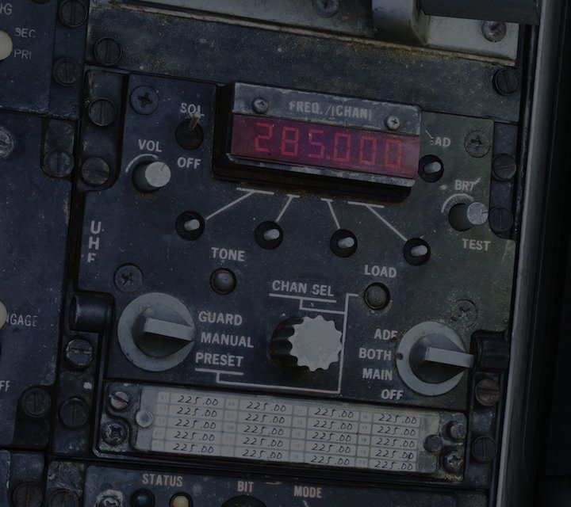
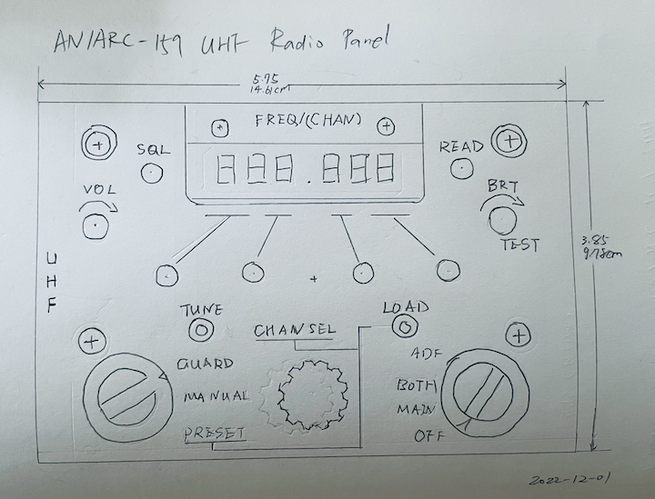

# F-14B Tomcat ARC-159 Radio Panel

*This is WIP!!*

AN/ARC-159(V) 1 UHF Control Panel for DCS F-14B Tomcat. Built with Arduino-compatible microcontroller board Pro Micro, use with [DCS BIOS](https://github.com/dcs-bios/dcs-bios).

## Parts

* 5V/16MHz Pro Micro Board w/ ATmega32U4
* MAX7219 7-segment LED

## Design

This is how the AN/ARC-159 looks like in DCS F-14B:

The size of the original AN/ARC-159(V) is **5.75** inch in width and **4.875** inch in height. I don't need the frequency chart to record preset channel frequencies, so that part is removed from my design to make the panel size smaller:

* width: **5.75** (14.61cm)
* height: **3.85** (9.78cm)

## DCS-BIOS / HID Hybrid

This radio control panel works in DCS-BIOS/HID Hybrid mode.

1. Inputs: All switches, buttons and rotary encoders are mapped directly in DCS or other simulators. Although this panel is designed and modeled to look like ARC-159,
it can be used anywhere, as it's recognized as an HID joystick in Windows thanks to the ATmega32U4 chip on Pro Micro.
1. Outputs: The MAX7219 LED interfaces with DCS-BIOS to display DCS Radio channel or frequency based on mode. When in F-14B Rio seat, it will display the AN/ARC-182 info as well.
  * Will support some other DCS modules if possible.

## Arduino Libraries

* Flightpanels [DCS-BIOS Arduino Library](https://github.com/DCSFlightpanels/dcs-bios-arduino-library)
* [LedControl](https://github.com/wayoda/LedControl)
* [ArduinoJoystickLibrary](https://github.com/MHeironimus/ArduinoJoystickLibrary)

## License

Available under MIT license.
