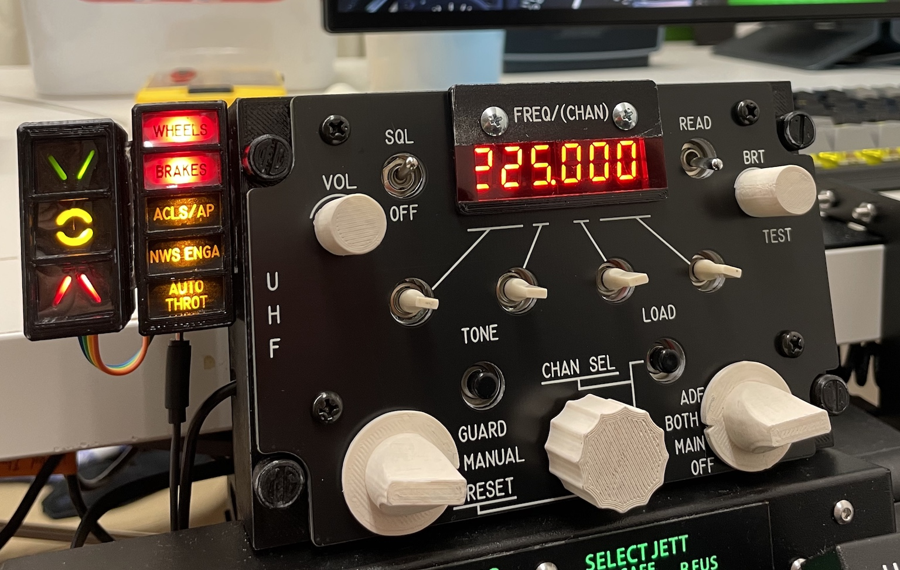
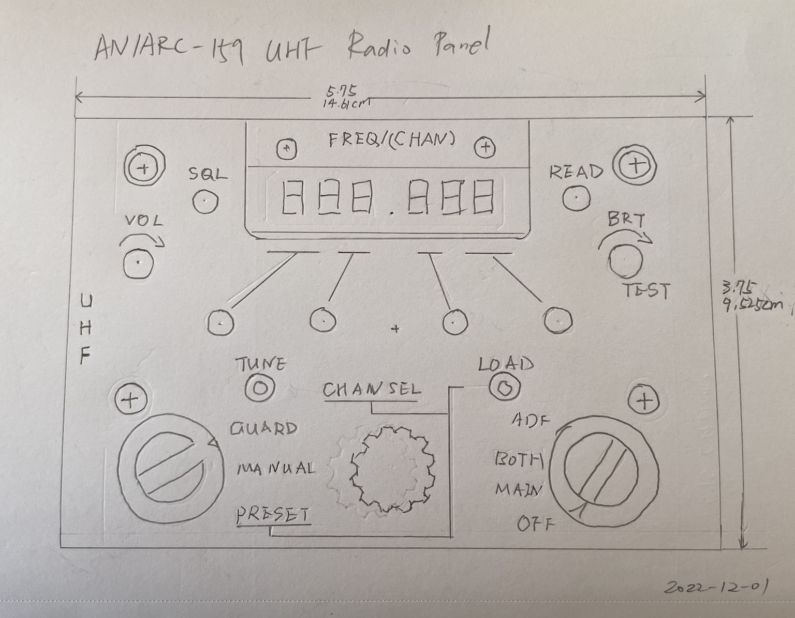
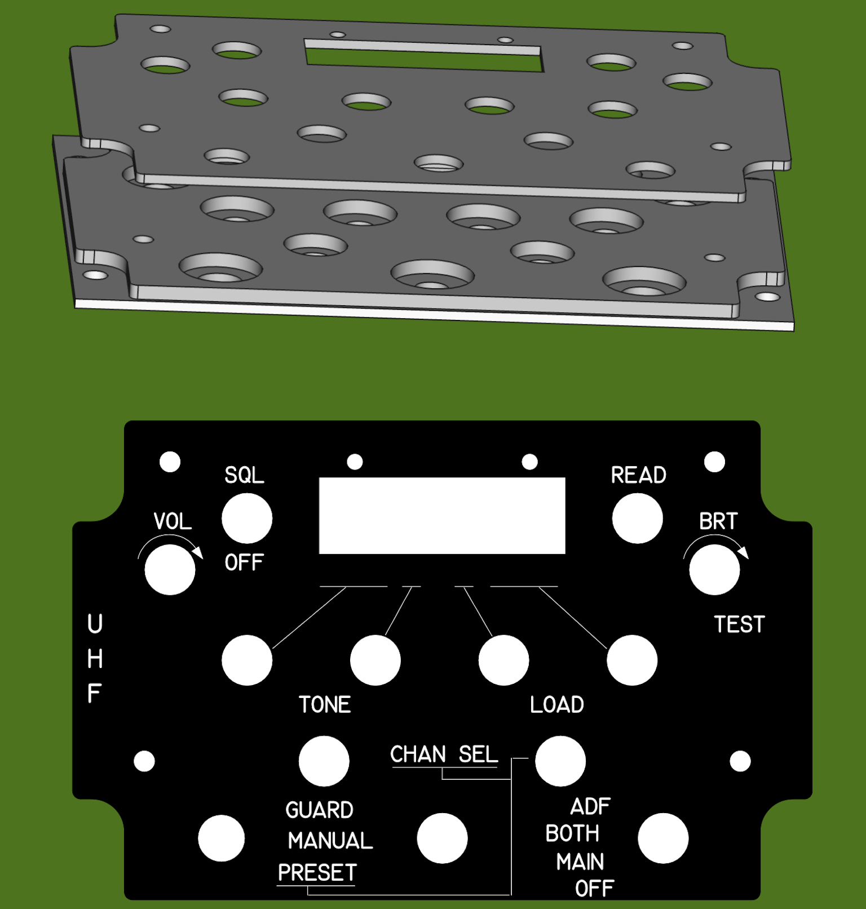

# F-14B Tomcat ARC-159 Radio Panel

AN/ARC-159(V) 1 UHF Control Panel for DCS F-14B Tomcat. Built with Arduino compatible microcontroller board Pro Micro, use with [DCS BIOS](https://github.com/dcs-bios/dcs-bios).

## Parts

* 5V/16MHz Pro Micro Board w/ ATmega32U4
* TM1637 6-Digit 7-Segment LED
* Mini toggle switches:
  * 4 (on)-off-(on) for freqency dials
  * 1 on-off for SQL
  * 1 (on)-off for READ
* 2 potentiometers for VOL and BRT
* 1 rotary encoder for preset channel selector
* 2 rotary switches for mode selector and function selector
* 2 push buttons for TUNE and LOAD

## Design

This is the final panel (AoA Indexer excluded, for AoA Indexer design see [here](../AoA%20Indexer)).

The size of the original AN/ARC-159(V) is **5.75** inch in width and **4.875** inch in height. I don't need the frequency chart to record preset channel frequencies, so that part is removed from my design to make the panel size smaller:

* width: **5.75** (14.61cm)
* height: **3.75** (9.525cm)

I design the panel using FreeCAD. It consists of three layers. The bottom and middle layers are composed and 3D printed as a single object.

Note the hole diameters are determined by looking at switches, buttons and encoders I have. They are likely to not fit for others.

## Pro Micro PINs Usage

Pro Micro has 18 digital PINs, 9 of which can also be used as analog inputs. This radio control panel will have 26 Joystick buttons and 2 axes as inputs, and 1 TM1637 LED as output. To connect them all without shift register, I'll use resistors to add simple voltage dividers to these:

* Freq (On)-Off-(On) Switches: use a single analog PIN instead of 2 digital PINs.
* Mode and Function Selector Rotary Switches: use a single analog PIN instead of 3 or 4 digital PINs.

|  PIN  | ARC-159 Function     | Button/Switch          |  Joystick Button/Axis | Note                      |
|:-----:|----------------------|------------------------|:---------------------:|---------------------------|
| 0/RX1 | Chan Sel             | Rotary Encoder 0 CLK   |          BTN8         | Rotate CW                 |
| 1/TX0 | Chan Sel             | Rotary Encoder 0 DT    |          BTN9         | Rotate CCW                |
|   2   | Tune                 | Push Button 0          |         BTN10         |                           |
|   3   | Load                 | Push Button 1          |         BTN11         |                           |
|  4/A6 | VOL                  | Potentiometer 0        | Axis0/X, BTN22, BTN23 | BTNs for Rotate CW/CCW    |
|   5   | SQL                  | On-Off Toggle Switch 0 |      BTN12, BTN13     | Off needed as well *1     |
|  6/A7 | BRT                  | Potentiometer 1        | Axis1/Y, BTN24, BTN25 | BTNs for Rotate CW/CCW *2 |
|   7   | Read                 | (On)-Off Switch 0      |         BTN14         |                           |
|  8/A8 | Mode Selector        | Rotary Switch 0        |      BTN15-BTN17      | 3 Pos, voltage divider    |
|  9/A9 | Function Selector    | Rotary Switch 1        |      BTN18-BTN21      | 4 Pos, voltage divider    |
|   10  | ❌                   | Rotary Encoder 0 SW    |         BTN26         | Misc button *3            |
|   A0  | Freq 10MHz Switch    | (On)-Off-(On) Switch 0 |       BTN0, BTN1      | Up/Down, voltage divider  |
|   A1  | Freq 1MHz Switch     | (On)-Off-(On) Switch 1 |       BTN2, BTN3      | ″                         |
|   A2  | Freq 0.1MHz Switch   | (On)-Off-(On) Switch 2 |       BTN4, BTN5      | ″                         |
|   A3  | Freq 0.025MHz Switch | (On)-Off-(On) Switch 3 |       BTN6, BTN7      | ″                         |
|   14  | Freq LED             | TM1637 LED DIO         |           ❌          | DCS BIOS Output           |
|   15  | Freq LED             | TM1637 LED CLK         |           ❌          | ″                         |

* *1: DCS needs separate keybinds for On and Off. For F-14B ARC-159 Squelch, it has `Squelch SQL`, `Squelch OFF` and `Squelch Toggle`. The first two will be used.
* *2: DCS doesn't have axis binding for `VOL`/`BRT` knobs; Create two buttons for `CW`/`CCW` similar to rotary encoder.
* *3: F-14B Radio Panel doesn't have a center push button on the CHAN SEL knob; Creating one for rotary encoder's button could be useful, say, to reset the panel to initial state.

## DCS-BIOS / HID Hybrid

This radio control panel works in DCS-BIOS/HID Hybrid mode.

1. Inputs: All switches, buttons and rotary encoders are mapped directly in DCS or other simulators. Although this panel is designed and modeled to look like ARC-159,
it can be used anywhere, as it's recognized as an HID joystick in Windows thanks to the ATmega32U4 chip on Pro Micro.
1. Outputs: The TM1637 LED interfaces with DCS-BIOS to display DCS Radio channel or frequency based on mode. When in F-14B Rio seat, it will display the AN/ARC-182 info as well. Currently these modules are supported:
  * F-14B Front Seat
  * F-14B Back Seat (RIO)
  * F-5E

## Arduino Libraries

* Flightpanels [DCS-BIOS Arduino Library](https://github.com/DCSFlightpanels/dcs-bios-arduino-library)
* [TM1637TinyDisplay](https://github.com/jasonacox/TM1637TinyDisplay)
* [ArduinoJoystickLibrary](https://github.com/MHeironimus/ArduinoJoystickLibrary)
* [NewEncoder](https://github.com/gfvalvo/NewEncoder)

## License

Available under MIT license.
