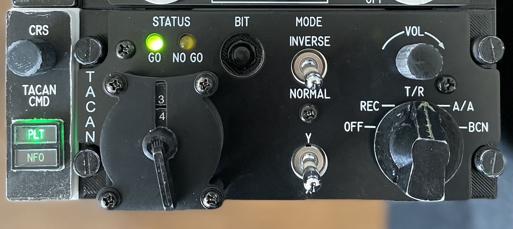

# F-14B Tomcat TACAN Panel

TACAN Panel for DCS F-14B Tomcat. Built with Arduino compatible microcontroller board Pro Micro, use with [Flightpanel DCS-BIOS fork](https://github.com/DCSFlightpanels/dcs-bios).

## Parts

* 5V/16MHz Pro Micro Board w/ ATmega32U4
* 2 5mm LED for BIT result (GO/NO GO lights)
* 2 toggle switches for operation mode and channel (X/Y)
* 1 push button for BIT
* 2 potentiometer for channel selector tens and VOL
* 1 rotary switch(12 pos) for channel selector ones

## Design

The TACAN panel size will be:

* width: **5.75** (146.1mm)
* height: **2.625** (66.68mm)

I design the panel using FreeCAD. It consists of three layers. The bottom and middle layers are composed and 3D printed as a single object.

For the top layer I yet have to find a way to make it. Not owning a laser or CNC engraver, this needs more experiments and ideas.

Note the hole diameters are determined by looking at switches, buttons and encoders I have. They are likely to not fit for others.

## Pro Micro PINs Usage

Pro Micro has 18 digital PINs, 9 of which can also be used as analog inputs. This TACAN control panel will have about 20 Joystick buttons and 2 axes as inputs.

* TACAN Mode Selector and Channel Rotary Switches: use a single analog PIN for each switch.

| **PIN** | **TACAN Function** | **Button/Switch**          | **Joystick Button/Axis** | **Note**               |
|:-------:|--------------------|----------------------------|:------------------------:|------------------------|
| 0/RX1   | BIT                | Push Button 0              | BTN0                     |                        |
| 1/TX0   | Mode Switch        | On-Off Toggle Switch 0     | BTN1, BTN2               |                        |
| 2       | X/Y Freq Selector  | On-Off Toggle Switch 1     | BTN3, BTN4               |                        |
| A0      | Function Selector  | Rotary Switch 0            | BTN5-BTN9                | 5 Pos, voltage divider |
| A1      | Freq Selector Tens | Potentiometer 0            | BTN10, BTN11             | BTNs for Rotate CW/CCW |
| A2      | Freq Selector Ones | Rotary Switch 1            | BTN12, BTN13             | BTNs for Rotate CW/CCW |
| A3      | Vol                | Potentiometer 1            | Axis0/X, BTN14, BTN15    | BTNs for Rotate CW/CCW |
| A9      | CRS                | Potentiometer 2            | Axis1/Y, BTN16, BTN17    | Extended, not on panel |
| 10      | TACAN CMD          | Push Button 1              | BTN18                    | Extended, not on panel |
| 15      | BIT GO LED         | LED Green                  | ❌                       | DCS BIOS Output        |
| 16      | BIT NO GO LED      | LED Yellow                 | ❌                       | DCS BIOS Output        |
| 7       | CMD Light PLT LED  | LED Green                  | ❌                       | DCS BIOS Output, extended, not on panel |
| 8       | CMD Light NFO LED  | LED Green                  | ❌                       | DCS BIOS Output, extended, not on panel |

## Arduino Libraries

* Flightpanels [DCS-BIOS Arduino Library](https://github.com/DCSFlightpanels/dcs-bios-arduino-library)
* [ArduinoJoystickLibrary](https://github.com/MHeironimus/ArduinoJoystickLibrary)
* [ResponsiveAnalogRead](https://github.com/dxinteractive/ResponsiveAnalogRead)

## License

Available under MIT license.
