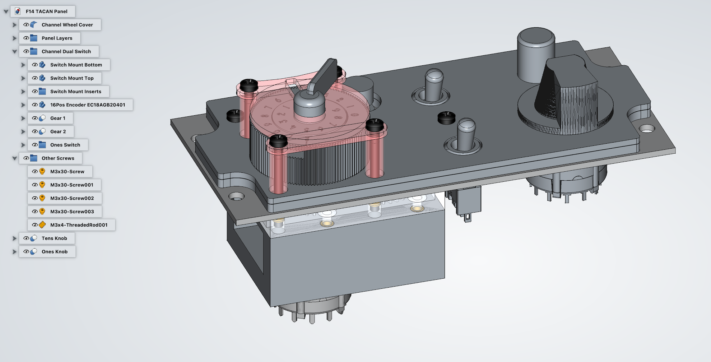

# F-14B Tomcat TACAN Panel

TACAN Panel for DCS F-14B Tomcat. Built with Arduino compatible microcontroller board Pro Micro, use with [DCS BIOS](https://github.com/dcs-bios/dcs-bios).

## Parts

* 5V/16MHz Pro Micro Board w/ ATmega32U4
* 2 5mm LED for BIT result (GO/NO GO lights)
* 2 toggle switches for operation mode and channel (X/Y)
* 1 push button for BIT
* 1 potentiometer for VOL
* 1 rotary switch(12 pos) for channel selector (ones)
* 1 rotary encoder(0-F 16 pos, 8421C) for channel selector (tens)

## Design

The TACAN panel size will be:

* width: **5.75** (146.1mm)
* height: **7.375** (66.68mm)

I design the panel using FreeCAD. It consists of three layers. The bottom and middle layers are composed and 3D printed as a single object.

For the top layer I yet have to find a way to make it. Not owning a laser or CNC engraver, this needs more experiments and ideas.

Note the hole diameters are determined by looking at switches, buttons and encoders I have. They are likely to not fit for others.

## Pro Micro PINs Usage

Pro Micro has 18 digital PINs, 9 of which can also be used as analog inputs. This TACAN control panel will have TBD Joystick buttons and TBD axes as inputs.

* TACAN Mode Selector and Channel Rotary Switches: use a single analog PIN for each switch.

TBD

|  PIN  | TACAN Function       | Button/Switch          |  Joystick Button/Axis | Note                      |
|:-----:|----------------------|------------------------|:---------------------:|---------------------------|

## Arduino Libraries

* Flightpanels [DCS-BIOS Arduino Library](https://github.com/DCSFlightpanels/dcs-bios-arduino-library)
* [ArduinoJoystickLibrary](https://github.com/MHeironimus/ArduinoJoystickLibrary)
* [NewEncoder](https://github.com/gfvalvo/NewEncoder)

## License

Available under MIT license.
